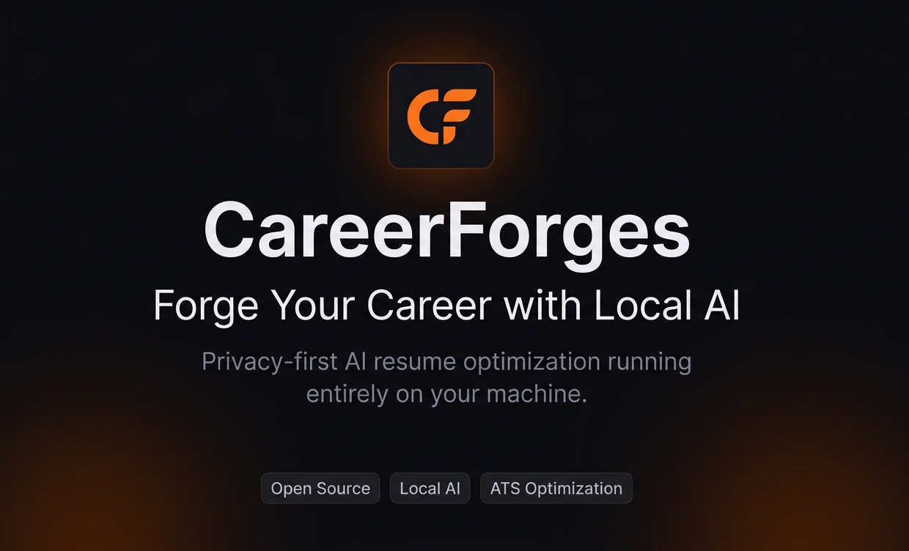

# CareerForges 🚀

**Your AI-Powered Local Job Application Assistant**

CareerForges is an open-source desktop application designed to help job seekers automate and optimize their job application process using AI agents running completely on their local machine.

Instead of requiring coding knowledge or cloud subscriptions, CareerForges allows users to use pre-installed AI agents like Claude CLI, Ollama, or other local AI tools directly from a simple desktop interface.

The goal is simple:

> Help anyone create ATS-friendly resumes, discover jobs, and streamline applications — all while keeping their data private and local.

---

## ✨ Features

### 🤖 Local AI Agent Integration

* Works with:

  * Claude CLI
  * Ollama
  * Future support for more AI agents
* Automatically detects installed AI tools
* Option to guide users through installation

---

### 📄 ATS-Friendly Resume Builder

* Upload existing resume
* AI optimizes resume for:

  * ATS systems
  * Specific job descriptions
  * Keywords & formatting
* Generate multiple resume versions instantly

---

### 🔍 AI-Powered Job Search

Users can:

* Search jobs by:

  * Role
  * Skills
  * Location
  * Experience
  * Time range (last 24h, 7 days, etc.)
* Get curated job URLs
* Filter latest openings

---

### ⚡ Application Workflow Automation

Planned automation features:

* Auto-fill applications
* Resume switching based on job description
* Smart cover letter generation
* Browser automation (optional future feature)

If full robotic automation isn't possible:

* CareerForges will still provide:

  * Optimized resume
  * Matching job links
  * Suggested application workflow

---

### 🛡️ Privacy First

* No cloud storage
* No user data collection
* Everything runs locally on the user's computer
* Resume and job history stay private

---

### 📊 Dashboard

The app includes a dashboard where users can:

* Track applied jobs
* Save resumes
* Monitor application status
* View AI suggestions
* Manage job searches

---

## 🎯 Why CareerForges?

Most job seekers:

* Don't know how to code
* Can't set up AI workflows manually
* Don't want complicated CLI tools
* Care about privacy

CareerForges bridges that gap by turning powerful local AI agents into an easy-to-use desktop application.

---

## 🧠 Vision

We believe AI should help everyone access better career opportunities — not just developers.

CareerForges aims to become:

* A personal AI career assistant
* Fully local and privacy-focused
* Open-source and community-driven
* Accessible to anyone

---

## 🏗️ Planned Tech Stack

| Area              | Technology                      |
| ----------------- | ------------------------------- |
| Frontend          | Electron / Tauri                |
| UI                | React + Tailwind                |
| AI Runtime        | Claude CLI, Ollama              |
| Backend           | Local Node.js / Rust services   |
| Automation        | Playwright / Browser Automation |
| Database          | Local SQLite                    |
| Resume Processing | PDF/Text Parsing                |

---

## 📌 Roadmap

### MVP

* [ ] Local AI integration
* [ ] Resume upload
* [ ] ATS resume generation
* [ ] Job search
* [ ] Dashboard UI

### Future Features

* [ ] Application automation
* [ ] Multi-agent support
* [ ] AI interview preparation
* [ ] Resume scoring
* [ ] LinkedIn optimization
* [ ] Smart career analytics
* [ ] Ad-supported free tier

---

## 🤝 Contributing

We welcome contributors, ideas, and feedback from developers, designers, and job seekers.

If you'd like to contribute:

1. Fork the repository
2. Create a feature branch
3. Submit a pull request

---

## Documentation

- [Developer Setup Guide](./docs/setup/developer-setup.md)
- [Development Environment Guide](./docs/setup/development-setup.md)

## 📜 License

This project will be released under the MIT License.

## Legal

- [MIT License](LICENSE)
- [Trademark Policy](TRADEMARK.md)
- [Code of Conduct](CODE_OF_CONDUCT.md)
- [Contributing Guide](CONTRIBUTING.MD)

---

## 🌍 Open Source Mission

CareerForges is being built to empower millions of job seekers worldwide with free AI-powered career tools that respect privacy and run locally.

---

## ⭐ Support the Project

If you like the idea:

* Star the repository
* Share it with others
* Contribute to development
* Suggest features

---

* “Forge Your Career with AI”

